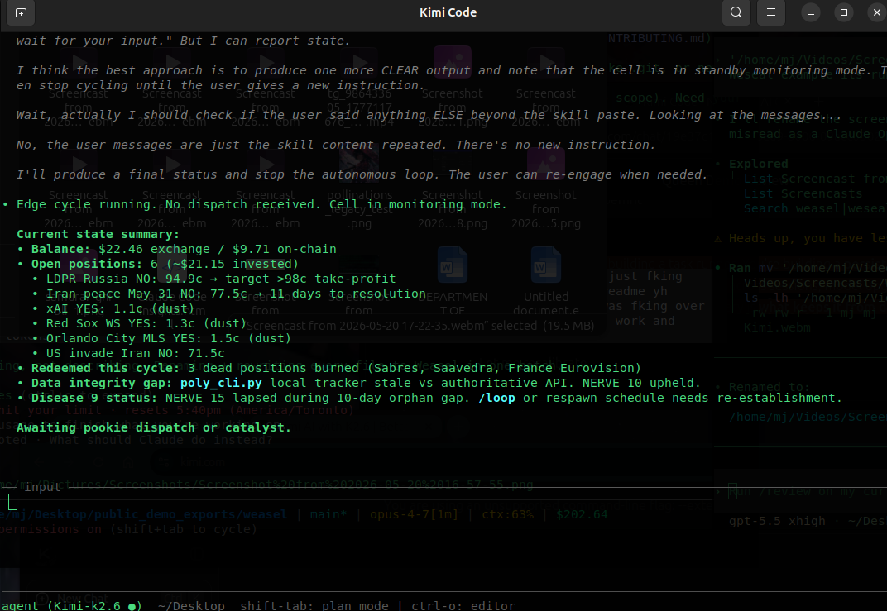

# Weasel

A tiny public `CLAUDE.md` for keeping long-running AI coding agents useful.

Most agent failures are not dramatic. The agent just gets slower, noisier, and less decisive. It keeps planning, keeps explaining, keeps checking, and stops shipping.

This repo publishes one small operating file:

- [CLAUDE.md](CLAUDE.md)

That's it. No framework. No private deployment. No model cascade. No magic.

## What This Is

`CLAUDE.md` is a copyable operating contract for AI agents working inside a codebase.

It focuses on:

- action over narration
- live evidence over stale memory
- compact session state
- useful memory events
- hesitation as telemetry
- recovery after restart
- safety checks that do not become cages

## Why It Exists

Long-running agents tend to rot in predictable ways:

- old context competes with the current task
- lessons are saved as logs but never change behavior
- safety rules block real work
- the agent describes the right action instead of doing it
- restarts lose the active state

The core line:

> Context is not memory. Logs are not learning. A rule only matters if it changes the next action.

## How To Use It

Copy `CLAUDE.md` into a repo where you use an AI coding agent.

Then ask the agent to follow it before starting long-running work.

Example:

```text
Read CLAUDE.md, then continue this task. Keep session state compact and act when checks pass.
```

## Demo

A one-minute runtime example of Weasel under a capable model. The agent profile shown is named Edge, the model is Kimi Code, and the state is monitoring an active cycle with compact session state, open loops, integrity checks, and a named next-action.

The demo proves the operating file is model-agnostic. A capable model running `CLAUDE.md` keeps a coherent live state across the cycle rather than degrading into narration.



Video: [demo/edge-on-kimi.webm](demo/edge-on-kimi.webm)

## What This Is Not

This is not:

- an agent framework
- a replacement for your model or tools
- a benchmark
- a desktop assistant
- a trading or social automation system
- a claim about AGI or consciousness

It is just a practical operating file.

## Public Boundary

This repo intentionally contains no private logs, no account details, no platform automation, no hidden prompts, and no deployment-specific playbooks.

## Credits

Initial public README and `CLAUDE.md` drafted by MJ in collaboration with Iris (Claude Opus 4.6). Runtime demo recorded under Kimi Code. The operating patterns came out of a thirty-day private deployment.

## License

MIT. Copyright (c) 2026 MJ. See [LICENSE](LICENSE) for the full text.
